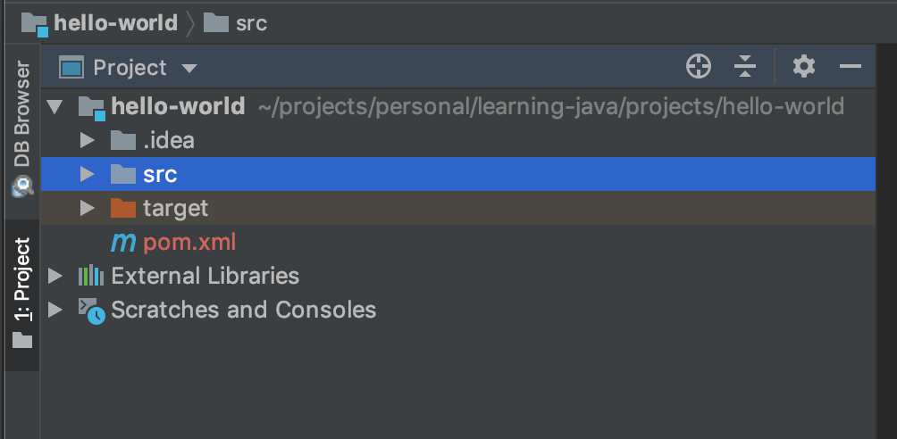
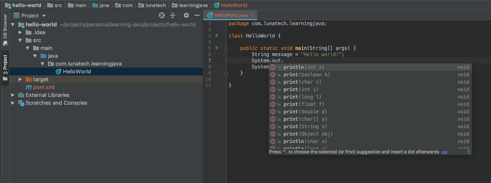
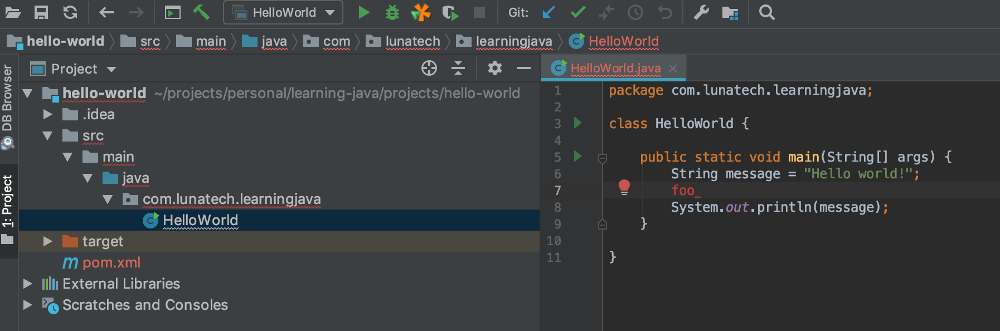
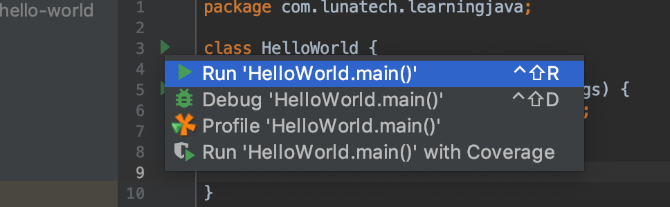
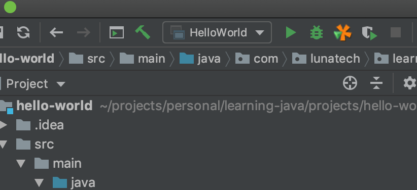

# Getting Started

This project is to get familiar with some of the tools we use as Java developer, and setting up your environment.

## Install Java

There are only two version of Java that matter currently. Java 8 and Java 11. Both are LTS (Long Term Support) releases. Java 9 and 10 are not. Java 11 is pretty recent, and as of this writing (1-2-2019), most companies do not run Java 11 yet. Java 8 is what most companies run, and while not great, it's decent. Anything older than Java 8 should be scoffed at.

You should install both Java 8 and Java 11 on your machine.

It's good to know that Java comes in several flavours: A JDK (Java Development Kit), that you use to *develop* Java applications, and a JRE (Java Runtime Environment) that is used to *run* Java applications. When you compile a Java application, you don't end up with a native binary - like you would get when compiling a C or rust application. Instead, you get a bunch of `.class` files, which are an intermediate representation. These class files contain instructions called _byte code_, and byte code is portable. A JRE contains a JVM (Java Virtual Machine), which is an application that executes `.class` files. A JVM is platform-specific and will optimize the execution of `.class` files for the platform it runs on.

So you can compile your code once to `.class` files and run it on multiple platforms. This is convenient, although certainly not a game-changer.

Java was created by Sun, which was acquired by Oracle several years ago. More recently, Oracle stopped providing a free (well, it's still free but you're not allowed to use it commercially) JDK, but donated most of the JDK code to the OpenJDK project, which now provides free JDKs.

So for Java 8, you can still get a fine JDK from Oracle, and for Java 11, you should get it from OpenJDK.

Besides Oracle and OpenJDK, there are other vendors of JVMs. For example, Amazon created Corretto. For our purposes, The Oracle JDK for Java 8, and the OpenJDK one for Java 11 will work fine.

For Java 8, download the JDK from Oracle: https://www.oracle.com/technetwork/java/javase/downloads/index.html

For Java 11, the easiest way is to use

    brew cask install java

## Install jenv

Now that you have multiple Java versions on your machine, you need a convenient way to switch between them. Because some software you'll write with Java 11, and some other with Java 8.

`jenv` is a tool that helps you with that. It switches the symlink of your `java` and `javac` binaries to the version that you choose, and can also set the `JAVA_HOME` environment variable, which some processes use.

Install with:
    brew install jenv

Afterwards, you can run:

    jenv versions

This will list the Java versions available on your machine. (Maybe you need to run `jenv rehash` after you installed a new Java version).

Now you can either set your version globally by using

    jenv global 1.8

or set it locally, meaning only for the current directory. This is especially convenient in case you have one project that needs a different java version. Setting a local version with `jenv local` will create a `.java-version` file in the directory, and jenv will automatically configure your Java version every time you enter that directory in your shell.

Fun fact: Until Java 8, the official version was 1.8. So , As of 9, they realized that major versions were more appropriate, so when you list your versions with `jenv versions`, you should see at least `1.8` and `11`.

### Trying it out

You should be able to do something like the following in some directory, to verify that you have two working Java versions

    ➜  tmp jenv local 11
    ➜  tmp java -version
    openjdk version "11" 2018-09-25
    OpenJDK Runtime Environment 18.9 (build 11+28)
    OpenJDK 64-Bit Server VM 18.9 (build 11+28, mixed mode)
    ➜  tmp jenv local 1.8
    ➜  tmp java -version
    java version "1.8.0_144"
    Java(TM) SE Runtime Environment (build 1.8.0_144-b01)
    Java HotSpot(TM) 64-Bit Server VM (build 25.144-b01, mixed mode)

Note, the `➜` comes from my ZSH shell, but any other shell will be fine as well.

## Install Intellij

You can program Java without an IDE, and if you choose to use an IDE, you can pick from several good ones.

But for this set of exercises, use Intellij. The community edition will work just fine.

## Install Maven

Maven is the most widely used build tool for Java projects. It does - among other things - the following things for you:

 * Dependency management. It downloads Java libraries that you want to use from library repositories.
 * Invoking the Java compiler with the right set of arguments and source file locations.
 * Running the tests of your application.
 * Generating the project documentation
 * Packaging your application
 * Publishing your library to a repository

Maven has a plug-in architecture, and with plugins it can do a ton more. We'll run into several of them later.

To use Maven, you write a POM (Project Object Model) file, which describes your project. The POM file is an XML file. Many Java IDE's (including Intellij) understand POM files as well, and can use it to also understand how your project is setup.

This is extremely convenient: Maven can use the POM file in headless environments (such as a Jenkins machine) to build your project, and your IDE can also use the POM file to learn how your project is supposed to work, which dependencies it needs, and also run your application.

Your Maven POM file should be checked into Git, so that your colleagues can use the same POM file. Any IDE specific configuration, like Intellij's `.iml` files should be excluded from repositories! Each team member should generate his own IDE config from the Maven POM file. This gives the best project portability.

So install maven! Using brew:

    brew install maven

## Putting it all together

This directory contains a directory `hello-world`, which contains Java project. Let's use it to test your setup.

### Import the project into Intellij

As mentioned before, we don't store Intellij specific files in Git, only the Maven POM file. That means we can't just 'Open' the project in Intellij, we have to 'Import' it. This can be done in two ways, that have the same result. From the Intellij start screen (when no project is open), you can select "Import Project", then open the 'hello-world' directory, and choose "Import project from external model", and "Maven" and then "Next" a couple of times. One of the screens will ask which project SDK to use. For this project, either Java 8 or 11 will be fine. If you don't see your SDK's yet, use the `+` symbol to add them. Normally, they are in `/Library/Java/JavaVirtualMachines/some-jdk-version/Contents/Home`.

### Checking that it works

If the project is successfully imported, you should see the 'hello-world' project show up on the left:

When you unfold the `src` directory, all the way until you see `HelloWorld.java`, you should notice that the `java` directory is marked in a blue color. This means that Intellij figured out that this is a Java sources directory.

You might want to check out the `pom.xml` file. This is a very minimal one. Notice that in the pom file, nothing like a source directory is configured! Yet Intellij knows what the source directory is. This is because Maven has a convention. If nothing else is configured (and typically, you should not configure it yourself), the default directory for Java source files is `src/main/java`.

When you open the HelloWorld.java file, (beware: the `.java` suffix is not shown in the project view), you'll see that it's highlighted. If you start typing something, it will give you autocompletion, like this:

And when you type something that isn't correct, Intellij will warn you by underlining the broken files and packages in red:

Notice from this last screenshot also the two green arrows in the left margin of the file. These can be used to run the application.

After running it, at the bottom of your screen you should see a pane that shows something like:

    Hello world!

    Process finished with exit code 0

This means your application successfully ran!

After running it with the arrow in the margin the first time, Intellij also creates a _Run Configuration_ for you:

Now you can run the project also using this configuration. That's more convenient, because you can also run it easily when you're not working on the `HelloWorld.java` file.

You can run the selected run configuration also using Control-R.

## Taking a closer look at the HelloWorld.java file

Let's take a better look at the `HelloWorld.java` file. For the uninitiated, it contains a lot of magic incantations.

During your first driving lesson, there's so much to see: roads, traffic signs, lights, pedestrians, cyclists, other cars. It seems you need to pay attention to everything. But for the experienced driver, only that blue car that seems to sway and that child on the sidewalk are things to pay conscious attention to, the other things are processed by the unconscious.

It's similar here. The experienced Java developer will only see very little code and keywords here, processing most of it unconsciously.

Let's go through it line by line:

    package com.lunatech.learningjava;

Java code is organized in packages. Packages form a nested structure, just like directories. In fact, the Java compiler mandates that your directory structure mimics your package structure. That's why `HelloWorld.java` is (looking from the `src/main/java` source directory) in the `com/lunatech/learningjava` directory.

Try changing the package name to something else and observe the error in Intellij instructing you to really stick to this.

    class HelloWorld {

This defines a new _class_. A class serves multiple purposes in Java. We will see these purposes in the next assignments. For now it suffices to say that all code in Java must be inside a class.

    public static void main(String[] args) {

This is a lot to swallow. This code defines a method called `main`. This method takes one argument, called `args`. Java being a statically typed language, requires that you inform it of the type of all the arguments of every method. In this case, the type of the `args` argument is `String[]`. A `String` is basically a piece of text. The name comes from the notion that a piece of text is a string of characters. The `[]` suffix indicates that we don't expect a single `String` here, but an array of strings. An array is basically a list. We'll explain more about Array's later.

Immediately before the name of the method, we indicate what the method returns. Our `main` method returns nothing, and the Java keyword for that is `void`.

Then, we say that this is a `static` method. A `static` method can be called without needing an _instance_ of the class.

Finally, we say that this is a `public` method. `public` is one of the possible _access modifiers_. Access modifiers can be used to control which code is allowed to call a method. Public means that all code is allowed to call this method. We'll see more on access modifiers later.

The `main` method as defined like this is magical: it indicates that this particular class is not just any old class, but a Java _application_. This is a class that the JVM can run as the starting point of an application! To illustrate this, change the name to `main2` and observe that the green triangle that we used to run the application in the margin of the file disappears! Removing `static` or `public`, changing `String[]` to `String` or `void` to `String` all have the same effect: it's no longer the method that the JVM expects to be able to start the application.

    String message = "Hello world!";

This creates a variable of type `String` with the name `message`, and assigns it the value `"Hello world"`. The latter is a _String literal_.

People have been calling Java _verbose_ for a long time, and this line shows one of the reasons why. On the right side of the `=`-symbol, we have a `String`. We want to create a new variable `message`, and assign a String to it. Obviously, the compiler can infer in this case that the type of `message` should be `String`. Now in this example it's not even the worst, but consider the following:

    ArrayList<String> strings = new ArrayList<String>();

Here we create a new variable `strings` of type `ArrayList<String>`, and immediately initialize it to a new ArrayList<String> instance.

This duplication is awkward, but it's how Java has been for many years. But with Java 11, finally this has been improved. Java 11 has _local type inference_, meaning that the compiler can infer the type of a variable in some cases. The above cases can now be written as:

    var message = "Hello world!";  
    var strings = new ArrayList<String>();

Give this a try if you're using Java 11!

The last non-trivial line of the file is:

    System.out.println(message);

This retrieves the `out` field on the `System` class. The `out` field has type `PrintStream`. In Intellij you can learn this by selecting it, and hitting Ctrl-Shift-P.

`PrintStream` has a method `println`, which takes a String and prints it, appending a newline to it.

*This* particular `PrintStream` instance prints to the console. That's not an intrinsic feature of `PrintStream` through. `PrintStream` is an abstraction for 'things to which you can print something', and the `PrintStream` instance that you get with `System.out` happens to be one that's connected to the stdout of your JVM.

This concludes the Getting Started section. It's by no means a full Java Tutorial, but hopefully it helped you through some parts of getting your environment ready that's typically difficult to do without an experienced Java developer sitting next to you.

## Exercise

A Java project can have multiple classes with `main` method. Create a new file `BMICalculator.java` next to `HelloWorld.java`.

Make a Body Mass Index calculator, that takes two parameters, one for the person's length and one for the person's weight.

Figure out how to pass parameters to your application (Hint: Do this in the Run Configuration of Intellij. They will end up in the `args` argument of the main method).

Make your application print the BMI.

Make your application also print the classification of the BMI (underweight, healthy, overweight, obese, etc.).

Use the 'jansi' library to color the output. A healthy BMI should give a green message, obese red and in between something yellow or orange!

Add JUnit as a dependency to your application.

Create a unit test for the BMI calculation method.
